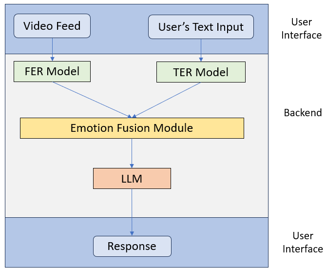
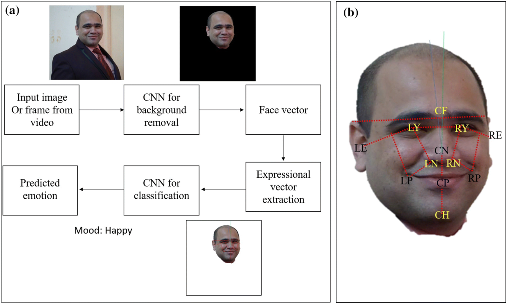
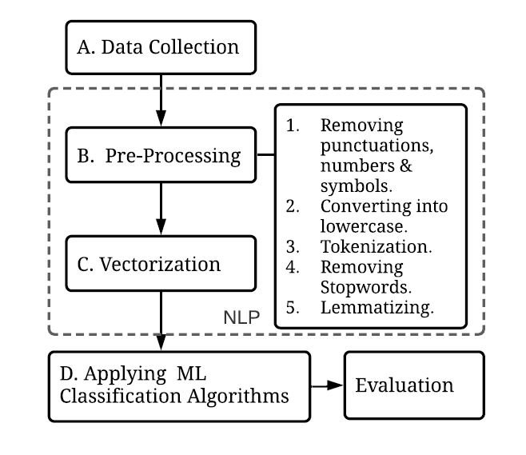
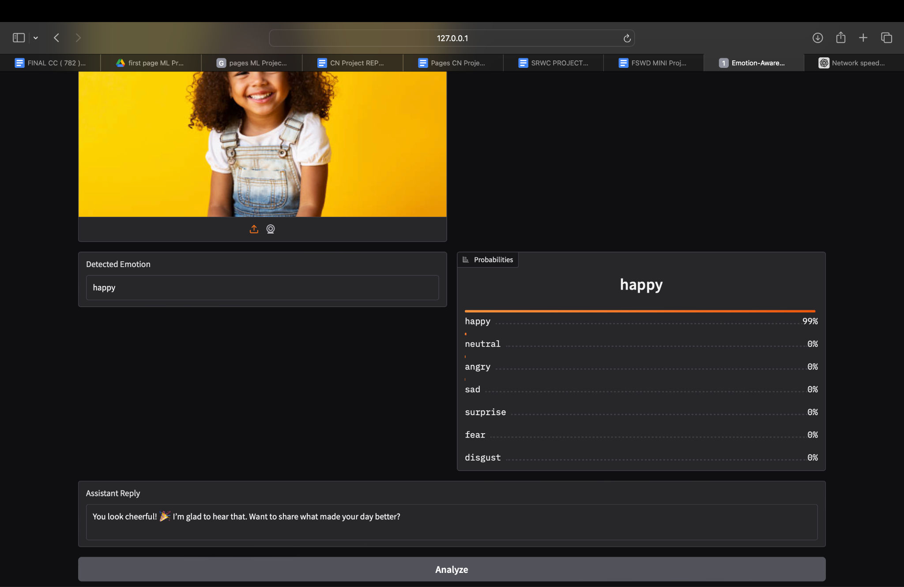
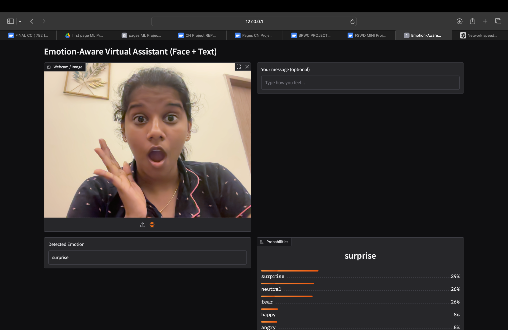
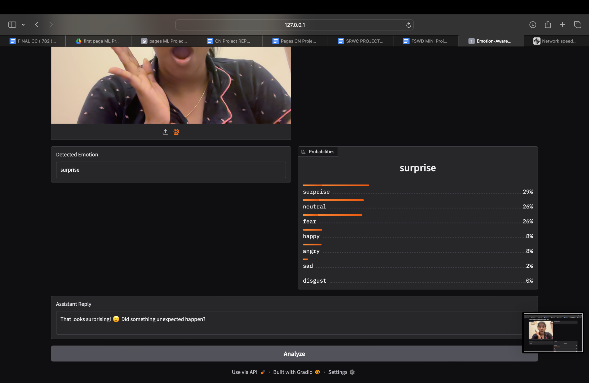
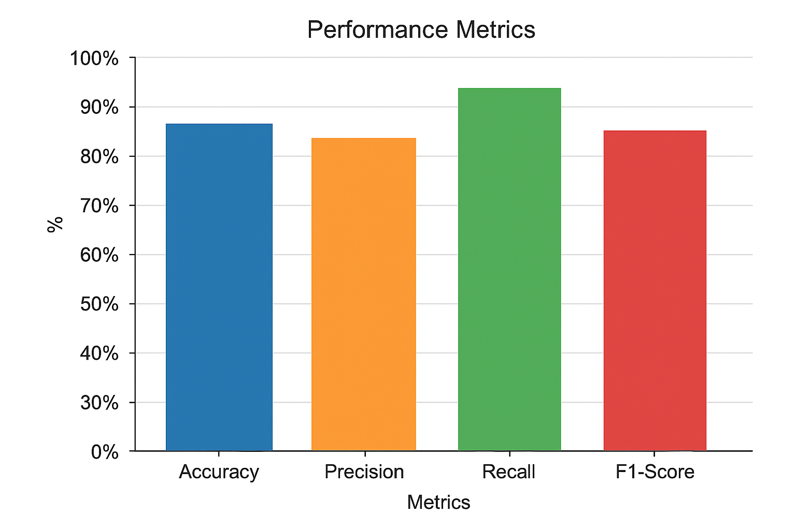
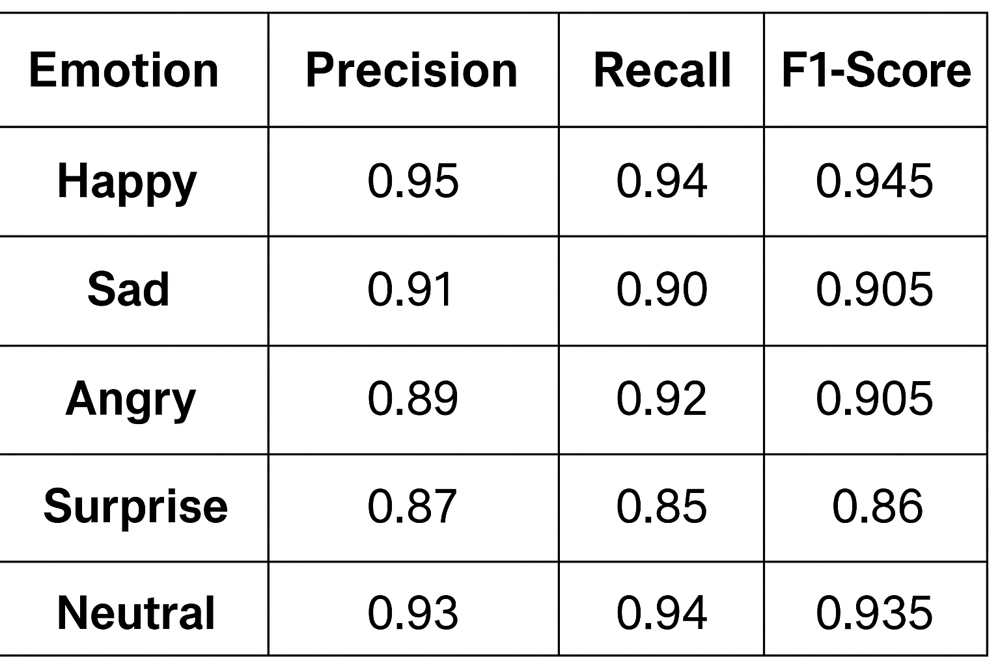

# Emotion-Aware Virtual Assistant

A local, VS Code-friendly assistant that reads **facial emotion** (via a compact PyTorch CNN) and **text sentiment** (via NLTK VADER), fuses the two signals, and replies with an empathetic message — all through a simple **Gradio** web UI with webcam or image upload support.

## Features

- Compact **CNN** (PyTorch) trained on **48×48** grayscale faces (FER2013-style, 7 emotion classes).
- **OpenCV Haar cascade** face detection with a centered-crop fallback.
- **NLTK VADER** sentiment analysis on free-text input.
- Simple fusion heuristic that biases the predicted emotion using text sentiment.
- **Gradio** UI: webcam/image input + text box → detected emotion, probability distribution, and an empathetic reply.
- Auto-selects the best available device: `mps` → `cuda` → `cpu`.

## Project Structure

```
emotion_assistant_vscode/
├─ app.py             # Gradio app: webcam/upload + text, fusion, reply
├─ model.py           # MiniEmotionCNN (PyTorch)
├─ utils.py           # Face preprocessing + VADER helper
├─ train_stub.py      # Minimal training script (replace with real training)
├─ requirements.txt
├─ weights/           # Place emotion_cnn.pt here
├─ assets/            # README images (architecture, demo screenshots, results)
└─ .vscode/
   ├─ settings.json
   └─ extensions.json
```

## Getting Started

### 1. Create & activate a virtual environment

```bash
python3 -m venv .venv
source .venv/bin/activate   # Windows: .venv\Scripts\activate
python -m pip install --upgrade pip
pip install -r requirements.txt
```

> **Apple Silicon (M1/M2/M3):** PyTorch will use the **MPS** backend automatically if available.

### 2. Provide model weights

- If you trained a model elsewhere (e.g. Colab), download `emotion_cnn.pt` and place it at `weights/emotion_cnn.pt`.
- Or generate a dummy/untrained weights file to test the pipeline:

```bash
python train_stub.py
```

### 3. Run the app

```bash
python app.py
```

Open the printed URL (usually `http://127.0.0.1:7860`) and allow camera access if prompted.

## Architecture

The system fuses a facial-emotion-recognition (FER) model with a text-emotion-recognition (TER) model before generating a response:



**Facial pipeline** — a face is detected, background-removed, and passed through the CNN to produce a predicted emotion:



**Text pipeline** — free-text input goes through a standard NLP preprocessing flow before scoring:



## Screenshots

Sample input image and the app's detected emotion + reply:




Full app view with webcam input:





## Evaluation Results

Overall performance on the held-out test set:



Per-class precision/recall/F1:



## Configuration

Set a custom weights path via environment variable:

```bash
export EMOTION_MODEL_PATH="weights/emotion_cnn.pt"
```

## Notes

- `utils.preprocess_face` uses an OpenCV Haar cascade for face detection; swap in a more robust detector (e.g. MediaPipe) if needed.
- To use TensorFlow/Keras weights instead, port the model architecture or export to ONNX and load with `onnxruntime`.

## Training

`train_stub.py` is a minimal example showing the expected data shape and save format. Replace `DummyFER` with a real FER2013-style dataset loader, then save weights compatible with `MiniEmotionCNN`:

```python
torch.save(model.state_dict(), "weights/emotion_cnn.pt")
```

## Troubleshooting

- **Camera blocked:** In your browser's site settings, allow Camera/Mic access for `localhost`.
- **NLTK VADER missing:** The app downloads the lexicon automatically on first run.
- **Device selection:** The app auto-selects `mps` → `cuda` → `cpu`.

## License

No license specified yet — add one (e.g. MIT) if you intend to share this publicly.
